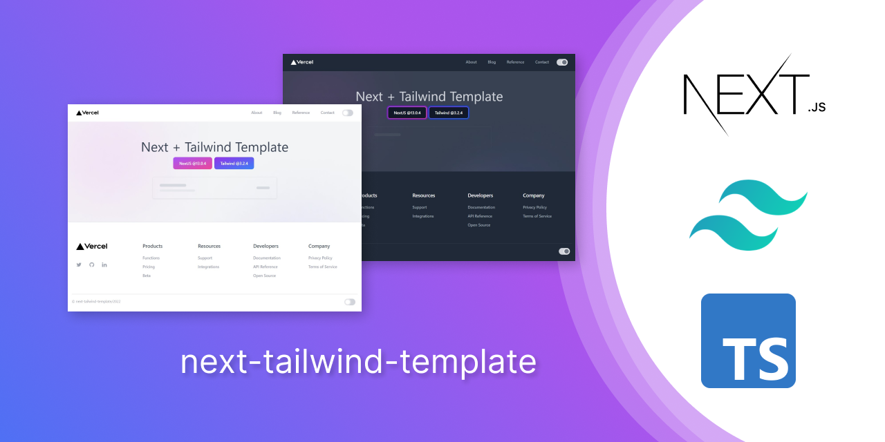
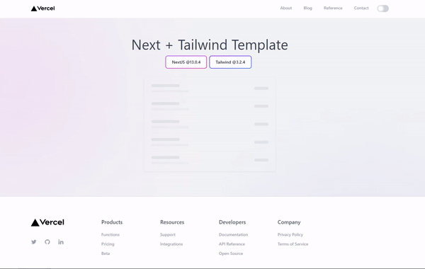

# NextJs+Tailwind CSS Starter Template 🔥




## [🟢 View Live](https://next-tailwind-template-three.vercel.app/)


<br/>

## Dependency 🔍

```json
  "dependencies": {
    "@types/node": "18.11.9",
    "@types/react": "18.0.25",
    "@types/react-dom": "18.0.9",
    "next": "13.0.4",
    "react": "18.2.0",
    "react-dom": "18.2.0",
    "typescript": "4.9.3"
  },

  "devDependencies": {
    "autoprefixer": "^10.4.13",
    "postcss": "^8.4.19",
    "tailwindcss": "^3.2.4"
  },
```

<br/>

## Create a Next.js App 🛠️

To create a Next.js app with this template, open your terminal, `cd` into the directory you'd like to create the app in, and run the command below:

**✒️ Note**:
Replace `next-project` with the project name you'd like to create, eg. `my-next-blog`.


```
npx create-next-app -e https://github.com/sandeep-shaw10/next-tailwind-template next-project
```

## Get Inside Project Directory 📂
```
cd next-project
```

## Run Development Server ⚙️

```
npm run dev
```

<br/>




<br/>

## Deploy with Vercel 🚀

Deploy this template using Vercel:

[](https://vercel.com/import/project?template=https://github.com/sandeep-shaw10/next-tailwind-template)

<br/>

## Features ✨
- [x] Version of `NextJS v13` and `Tailwind CSS v3`
- [x] Dark Theme Context and Hooks
- [X] Persistent Dark Theme via `localstorage`

`./hooks/useTheme.tsx`

```tsx
useEffect(() => {
    try{
        const theme = localStorage.getItem(keyVal)
        if(theme === THEME.DARK) setDark(true)
    }catch(err){
        localStorage.setItem(keyVal, THEME.LIGHT)
    }
}, [])
```

- [X] System Theme

`./hooks/useTheme.tsx`

```tsx
useEffect(() => {
    const { matches } = window.matchMedia("(prefers-color-scheme: dark)");
    setDark(matches)
}, [])
```

- [x] Modern Tailwind CSS components
- [x] Tailwind CSS Skeleton
- [x] Examples with **getStaticPath** and **getStaticProps**
<!-- - [ ] 🔴 **ISSUE**: Use of `any` keyword in TypeScript  -->

<br/>

## Maintainer 👨‍💻

This project is maintained by [@sandeep-shaw10](https://www.github.com/sandeep-shaw10)

<br/>

## Credits 🔒
- [Logo](./public/vercel.svg) used in this app is owned by [Vercel](https://vercel.com)
- [Deploy button image](https://vercel.com/button) used on this `README.md` is owned by [Vercel](https://vercel.com).